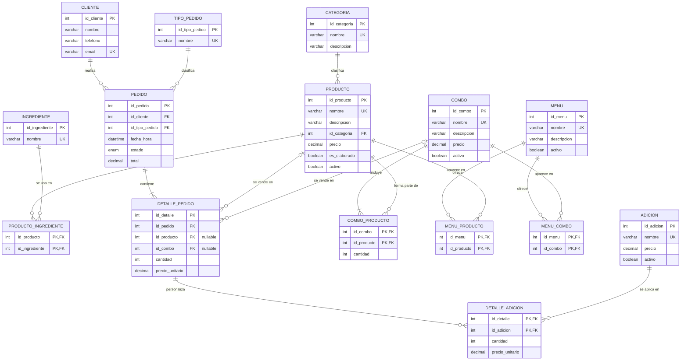

# 🍕 Campus Pizza — Base de datos para una pizzería

Base de datos relacional en **MySQL 8.0.16+** para gestionar productos, adiciones, combos, menús, clientes y pedidos (para recoger o consumir en el lugar) de una pizzería.

## 📁 Contenido del repositorio

| Archivo | Descripción |
|---|---|
| `estructura.sql` | Creación de la base de datos, tablas, claves primarias, foráneas y restricciones |
| `datos.sql` | Datos de prueba realistas (15 productos, 5 combos, 8 clientes, 30 pedidos) |
| `README.md` | Este documento: modelo, diagrama y las 20 consultas resueltas |

## ▶️ Cómo ejecutarlo

```bash
# 1. Crear la estructura (borra y recrea la BD campus_pizza)
mysql -u root -p < estructura.sql

# 2. Cargar los datos de prueba
mysql -u root -p < datos.sql

# 3. Entrar a la base de datos
mysql -u root -p campus_pizza
```

En **MySQL Workbench**: `File > Open SQL Script` → ejecutar `estructura.sql` y luego `datos.sql` (rayo ⚡).

> Las fechas de los pedidos son relativas a la fecha actual (`CURDATE()`), por eso las consultas de "último mes" siempre tienen datos.

---

## 🧩 Modelo lógico

### Entidades y atributos principales

| Entidad | Atributos clave | Descripción |
|---|---|---|
| `categoria` | **id_categoria**, nombre | Pizza, Panzarotti, Bebida, Postre |
| `producto` | **id_producto**, nombre, precio, es_elaborado, *id_categoria* | Todo lo que se vende individualmente. `es_elaborado` distingue pizzas/panzarottis de bebidas/postres |
| `ingrediente` | **id_ingrediente**, nombre | Ingredientes de los productos elaborados |
| `adicion` | **id_adicion**, nombre, precio | Extras: extra queso, salsas, tocineta… |
| `combo` | **id_combo**, nombre, precio | Paquete de varios productos a precio especial |
| `menu` | **id_menu**, nombre, activo | Carta disponible (permite tener varios menús) |
| `cliente` | **id_cliente**, nombre, telefono, email | Quien hace el pedido |
| `tipo_pedido` | **id_tipo_pedido**, nombre | Para recoger / Consumir en el lugar |
| `pedido` | **id_pedido**, *id_cliente*, *id_tipo_pedido*, fecha_hora, estado, total | Encabezado del pedido |
| `detalle_pedido` | **id_detalle**, *id_pedido*, *id_producto* ó *id_combo*, cantidad, precio_unitario | Líneas del pedido |

### Tablas intermedias (relaciones N:M)

| Tabla | Relación |
|---|---|
| `producto_ingrediente` | producto ↔ ingrediente |
| `combo_producto` | combo ↔ producto (con `cantidad` de cada producto) |
| `menu_producto` | menu ↔ producto |
| `menu_combo` | menu ↔ combo |
| `detalle_adicion` | línea de pedido ↔ adición (con `cantidad` y precio) |

### Cardinalidades

| Relación | Cardinalidad |
|---|---|
| categoria → producto | 1 : N |
| producto ↔ ingrediente | N : M |
| combo ↔ producto | N : M (mín. 1 producto por combo) |
| menu ↔ producto / menu ↔ combo | N : M |
| cliente → pedido | 1 : N |
| tipo_pedido → pedido | 1 : N |
| pedido → detalle_pedido | 1 : N (mín. 1 línea) |
| detalle_pedido → producto **ó** combo | N : 1 (exactamente uno de los dos, garantizado con `CHECK`) |
| detalle_pedido ↔ adicion | N : M |

### Decisiones de diseño

- **Producto o combo en una línea:** `detalle_pedido` tiene `id_producto` e `id_combo`, ambos nulos-able, con un `CHECK` que obliga a que solo uno esté lleno. Así un pedido mezcla productos sueltos y combos.
- **`precio_unitario` guardado en la línea:** conserva el precio histórico aunque el precio del producto cambie después.
- **Adiciones por línea:** las adiciones se asocian a la línea (no al pedido), así se sabe a qué producto se le agregó cada extra (ej. extra queso en un panzarotti).
- **`es_elaborado`:** permite separar productos no elaborados (bebidas, postres) sin depender del nombre de la categoría.
- **`pedido.total`:** se calcula como suma de líneas + adiciones (el script de datos lo calcula con un `UPDATE`).

---

## 🗺️ Diagrama Entidad-Relación

> GitHub renderiza este diagrama automáticamente (Mermaid). Para la evidencia del examen también puedes importar `estructura.sql` en **drawSQL** o hacer *Reverse Engineer* en **MySQL Workbench** y tomar captura.



---

## 🔎 Consultas SQL

> **Convenciones usadas en las consultas**
> - Una *línea* de `detalle_pedido` es un producto suelto **o** un combo.
> - Cuando una consulta habla de "productos vendidos" se cuentan las líneas de producto suelto, salvo la consulta 5, que también "expande" los productos dentro de los combos usando `combo_producto`.
> - "Último mes" = `fecha_hora >= DATE_SUB(NOW(), INTERVAL 1 MONTH)`.
> - Días de la semana: `WEEKDAY()` devuelve 0 = lunes … 6 = domingo; se traduce con `ELT()`.

### 1. Productos más vendidos (pizza, panzarottis, bebidas, etc.)

```sql
SELECT pr.nombre            AS producto,
       c.nombre             AS categoria,
       SUM(dp.cantidad)     AS unidades_vendidas
FROM detalle_pedido dp
JOIN producto  pr ON pr.id_producto  = dp.id_producto
JOIN categoria c  ON c.id_categoria  = pr.id_categoria
GROUP BY pr.id_producto, pr.nombre, c.nombre
ORDER BY unidades_vendidas DESC;
```

**Lógica:** se unen las líneas de pedido con producto y categoría (el `JOIN` por `id_producto` descarta automáticamente las líneas de combos, que tienen `id_producto` nulo). Se suma `cantidad` por producto y se ordena de mayor a menor.

### 2. Total de ingresos generados por cada combo

```sql
SELECT cb.nombre                              AS combo,
       SUM(dp.cantidad)                       AS unidades_vendidas,
       SUM(dp.cantidad * dp.precio_unitario)  AS ingresos_totales
FROM detalle_pedido dp
JOIN combo cb ON cb.id_combo = dp.id_combo
GROUP BY cb.id_combo, cb.nombre
ORDER BY ingresos_totales DESC;
```

**Lógica:** solo las líneas con `id_combo` entran al `JOIN`. El ingreso es cantidad × precio al momento de la venta.

### 3. Pedidos realizados para recoger vs. comer en la pizzería

```sql
SELECT tp.nombre        AS tipo_pedido,
       COUNT(*)         AS total_pedidos
FROM pedido p
JOIN tipo_pedido tp ON tp.id_tipo_pedido = p.id_tipo_pedido
GROUP BY tp.id_tipo_pedido, tp.nombre;
```

**Lógica:** se agrupan los pedidos por su tipo y se cuenta cuántos hay de cada uno.

### 4. Adiciones más solicitadas en pedidos personalizados

```sql
SELECT a.nombre             AS adicion,
       SUM(da.cantidad)     AS veces_solicitada
FROM detalle_adicion da
JOIN adicion a ON a.id_adicion = da.id_adicion
GROUP BY a.id_adicion, a.nombre
ORDER BY veces_solicitada DESC;
```

**Lógica:** `detalle_adicion` solo existe para líneas personalizadas; se suma la cantidad solicitada por cada adición.

### 5. Cantidad total de productos vendidos por categoría

```sql
SELECT c.nombre              AS categoria,
       SUM(t.unidades)       AS productos_vendidos
FROM (
    -- Productos vendidos sueltos
    SELECT pr.id_categoria, dp.cantidad AS unidades
    FROM detalle_pedido dp
    JOIN producto pr ON pr.id_producto = dp.id_producto
    UNION ALL
    -- Productos vendidos dentro de combos (cantidad del combo × cantidad del producto en el combo)
    SELECT pr.id_categoria, dp.cantidad * cp.cantidad AS unidades
    FROM detalle_pedido dp
    JOIN combo_producto cp ON cp.id_combo    = dp.id_combo
    JOIN producto       pr ON pr.id_producto = cp.id_producto
) t
JOIN categoria c ON c.id_categoria = t.id_categoria
GROUP BY c.id_categoria, c.nombre
ORDER BY productos_vendidos DESC;
```

**Lógica:** el `UNION ALL` junta dos fuentes: productos vendidos sueltos y productos que salieron dentro de un combo. Así una Coca-Cola de un "Combo Pareja" también cuenta como bebida vendida.

### 6. Promedio de pizzas pedidas por cliente

```sql
SELECT ROUND(AVG(t.pizzas), 2) AS promedio_pizzas_por_cliente
FROM (
    SELECT cl.id_cliente, SUM(dp.cantidad) AS pizzas
    FROM cliente cl
    JOIN pedido         p  ON p.id_cliente   = cl.id_cliente
    JOIN detalle_pedido dp ON dp.id_pedido   = p.id_pedido
    JOIN producto       pr ON pr.id_producto = dp.id_producto
    JOIN categoria      c  ON c.id_categoria = pr.id_categoria
    WHERE c.nombre = 'Pizza'
    GROUP BY cl.id_cliente
) t;
```

**Lógica:** la subconsulta calcula cuántas pizzas pidió cada cliente (solo pizzas sueltas); la consulta externa promedia esos totales.

### 7. Total de ventas por día de la semana

```sql
SELECT ELT(WEEKDAY(fecha_hora) + 1,
           'Lunes','Martes','Miércoles','Jueves','Viernes','Sábado','Domingo') AS dia_semana,
       COUNT(*)      AS pedidos,
       SUM(total)    AS total_ventas
FROM pedido
GROUP BY WEEKDAY(fecha_hora)
ORDER BY WEEKDAY(fecha_hora);
```

**Lógica:** se agrupa por el número de día de la semana y se suma `pedido.total` (incluye combos y adiciones).

### 8. Cantidad de panzarottis vendidos con extra queso

```sql
SELECT COALESCE(SUM(da.cantidad), 0) AS panzarottis_con_extra_queso
FROM detalle_adicion da
JOIN adicion        a  ON a.id_adicion   = da.id_adicion
JOIN detalle_pedido dp ON dp.id_detalle  = da.id_detalle
JOIN producto       pr ON pr.id_producto = dp.id_producto
JOIN categoria      c  ON c.id_categoria = pr.id_categoria
WHERE a.nombre = 'Extra queso'
  AND c.nombre = 'Panzarotti';
```

**Lógica:** se cruzan las adiciones con la línea a la que pertenecen y se filtra por la adición "Extra queso" aplicada a productos de categoría Panzarotti. Se suma la cantidad de adiciones aplicadas.

### 9. Pedidos que incluyen bebidas como parte de un combo

```sql
SELECT DISTINCT p.id_pedido,
                cl.nombre   AS cliente,
                cb.nombre   AS combo,
                p.fecha_hora
FROM pedido p
JOIN cliente        cl ON cl.id_cliente  = p.id_cliente
JOIN detalle_pedido dp ON dp.id_pedido   = p.id_pedido
JOIN combo          cb ON cb.id_combo    = dp.id_combo
JOIN combo_producto cp ON cp.id_combo    = cb.id_combo
JOIN producto       pr ON pr.id_producto = cp.id_producto
JOIN categoria      c  ON c.id_categoria = pr.id_categoria
WHERE c.nombre = 'Bebida'
ORDER BY p.id_pedido;
```

**Lógica:** se parte de las líneas que son combos, se baja a los productos que componen cada combo y se filtran los que son bebidas. `DISTINCT` evita repetir el pedido cuando el combo trae varias bebidas.

### 10. Clientes que han realizado más de 5 pedidos en el último mes

```sql
SELECT cl.id_cliente,
       cl.nombre,
       COUNT(*) AS pedidos_ultimo_mes
FROM cliente cl
JOIN pedido p ON p.id_cliente = cl.id_cliente
WHERE p.fecha_hora >= DATE_SUB(NOW(), INTERVAL 1 MONTH)
GROUP BY cl.id_cliente, cl.nombre
HAVING COUNT(*) > 5
ORDER BY pedidos_ultimo_mes DESC;
```

**Lógica:** `WHERE` filtra el último mes antes de agrupar; `HAVING` filtra después de contar los pedidos por cliente.

### 11. Ingresos totales generados por productos no elaborados (bebidas, postres, etc.)

```sql
SELECT SUM(dp.cantidad * dp.precio_unitario) AS ingresos_no_elaborados
FROM detalle_pedido dp
JOIN producto pr ON pr.id_producto = dp.id_producto
WHERE pr.es_elaborado = FALSE;
```

**Lógica:** usa el campo `es_elaborado` del producto. Solo cuenta productos vendidos sueltos (el precio de un combo no se puede dividir por producto).

### 12. Promedio de adiciones por pedido

```sql
SELECT ROUND(
         (SELECT COALESCE(SUM(cantidad), 0) FROM detalle_adicion)
         / (SELECT COUNT(*) FROM pedido)
       , 2) AS promedio_adiciones_por_pedido;
```

**Lógica:** total de adiciones solicitadas dividido entre el total de pedidos (incluye pedidos sin adiciones, que cuentan como 0).

### 13. Total de combos vendidos en el último mes

```sql
SELECT COALESCE(SUM(dp.cantidad), 0) AS combos_vendidos_ultimo_mes
FROM detalle_pedido dp
JOIN pedido p ON p.id_pedido = dp.id_pedido
WHERE dp.id_combo IS NOT NULL
  AND p.fecha_hora >= DATE_SUB(NOW(), INTERVAL 1 MONTH);
```

**Lógica:** líneas que son combo (`id_combo IS NOT NULL`) de pedidos del último mes; se suman sus cantidades.

### 14. Clientes con pedidos tanto para recoger como para consumir en el lugar

```sql
SELECT cl.id_cliente,
       cl.nombre,
       COUNT(*) AS total_pedidos
FROM cliente cl
JOIN pedido p ON p.id_cliente = cl.id_cliente
GROUP BY cl.id_cliente, cl.nombre
HAVING COUNT(DISTINCT p.id_tipo_pedido) = (SELECT COUNT(*) FROM tipo_pedido);
```

**Lógica:** un cliente cumple si la cantidad de tipos de pedido distintos que ha usado es igual al total de tipos existentes (2).

### 15. Total de productos personalizados con adiciones

```sql
SELECT COUNT(*)                  AS lineas_personalizadas,
       COALESCE(SUM(dp.cantidad), 0) AS unidades_personalizadas
FROM detalle_pedido dp
WHERE EXISTS (SELECT 1
              FROM detalle_adicion da
              WHERE da.id_detalle = dp.id_detalle);
```

**Lógica:** `EXISTS` selecciona las líneas con al menos una adición (sin duplicarlas aunque tengan varias). Se muestra el número de líneas y las unidades de producto afectadas.

### 16. Pedidos con más de 3 productos diferentes

```sql
SELECT p.id_pedido,
       cl.nombre   AS cliente,
       COUNT(*)    AS productos_diferentes
FROM pedido p
JOIN cliente        cl ON cl.id_cliente = p.id_cliente
JOIN detalle_pedido dp ON dp.id_pedido  = p.id_pedido
GROUP BY p.id_pedido, cl.nombre
HAVING COUNT(*) > 3;
```

**Lógica:** cada producto o combo distinto del pedido ocupa una línea, por lo que contar líneas por pedido equivale a contar ítems diferentes.

### 17. Promedio de ingresos generados por día

```sql
SELECT ROUND(AVG(t.ingreso_dia), 2) AS promedio_ingresos_por_dia
FROM (
    SELECT DATE(fecha_hora) AS dia,
           SUM(total)       AS ingreso_dia
    FROM pedido
    GROUP BY DATE(fecha_hora)
) t;
```

**Lógica:** se calcula el ingreso de cada día con ventas y luego se promedia (días sin pedidos no cuentan).

### 18. Clientes que han pedido pizzas con adiciones en más del 50% de sus pedidos

```sql
SELECT cl.id_cliente,
       cl.nombre,
       COUNT(*) AS total_pedidos,
       SUM(EXISTS (SELECT 1
                   FROM detalle_pedido dp
                   JOIN producto       pr ON pr.id_producto = dp.id_producto
                   JOIN categoria      c  ON c.id_categoria = pr.id_categoria
                   JOIN detalle_adicion da ON da.id_detalle = dp.id_detalle
                   WHERE dp.id_pedido = p.id_pedido
                     AND c.nombre = 'Pizza')) AS pedidos_pizza_con_adicion
FROM cliente cl
JOIN pedido p ON p.id_cliente = cl.id_cliente
GROUP BY cl.id_cliente, cl.nombre
HAVING pedidos_pizza_con_adicion / total_pedidos > 0.5;
```

**Lógica:** para cada pedido, `EXISTS` devuelve 1 si tiene al menos una pizza con alguna adición (0 si no). Sumando por cliente se obtienen los pedidos "pizza + adición" y se comparan contra el total de pedidos del cliente (> 50%).

### 19. Porcentaje de ventas provenientes de productos no elaborados

```sql
SELECT ROUND(
         (SELECT SUM(dp.cantidad * dp.precio_unitario)
          FROM detalle_pedido dp
          JOIN producto pr ON pr.id_producto = dp.id_producto
          WHERE pr.es_elaborado = FALSE)
         / (SELECT SUM(total) FROM pedido) * 100
       , 2) AS porcentaje_ventas_no_elaborados;
```

**Lógica:** ingresos de productos no elaborados (consulta 11) divididos entre las ventas totales (`SUM(pedido.total)`), multiplicado por 100.

### 20. Día de la semana con mayor número de pedidos para recoger

```sql
SELECT ELT(WEEKDAY(p.fecha_hora) + 1,
           'Lunes','Martes','Miércoles','Jueves','Viernes','Sábado','Domingo') AS dia_semana,
       COUNT(*) AS pedidos_para_recoger
FROM pedido p
JOIN tipo_pedido tp ON tp.id_tipo_pedido = p.id_tipo_pedido
WHERE tp.nombre = 'Para recoger'
GROUP BY WEEKDAY(p.fecha_hora)
ORDER BY pedidos_para_recoger DESC
LIMIT 1;
```

**Lógica:** se filtran los pedidos para recoger, se agrupan por día de la semana y se toma el día con más pedidos. (Si hubiera empate, `LIMIT 1` devuelve solo uno.)

---

## ✅ Restricciones de integridad implementadas

- Claves primarias en todas las tablas (compuestas en las tablas intermedias).
- Claves foráneas con `ON DELETE RESTRICT` para datos maestros (no se puede borrar un producto vendido) y `CASCADE` en tablas dependientes (detalles, relaciones de combos y menús).
- `UNIQUE` en nombres de catálogo y en el email del cliente.
- `CHECK` para precios y cantidades no negativos y para que cada línea de pedido sea **producto xor combo**.
